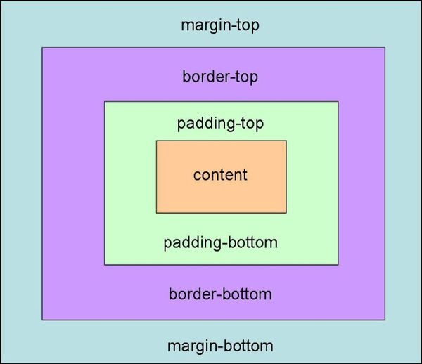
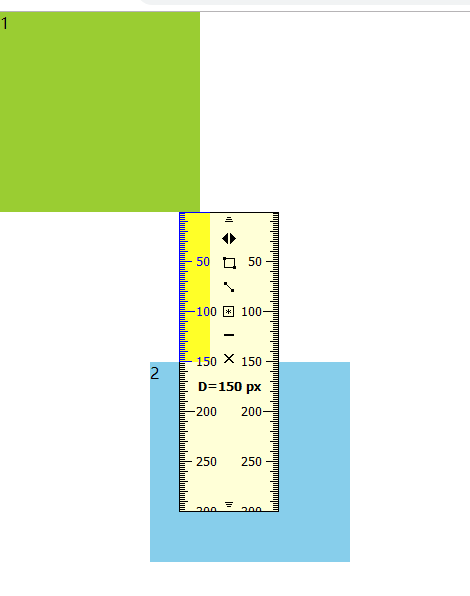
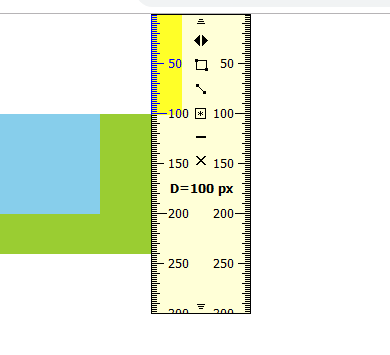

## 盒子模型简介



1. 属性说明：

- `margin` 外边距
- `padding` 内边距
- `border` 元素边框

2. 常用

`margin: 0 auto;` 让块级元素水平居中，块级元素例如div、p、li、h1~h6，margin对行内元素（span、strong）无效。

3. 盒子布局的稳定性：

优先级为： `width > padding > margin`


### 1 上下盒子的margin塌陷

**上下盒子**发生 margin 塌陷，margin 小的盒子塌陷在大的盒子，不是简单叠加。浮动后，左右 margin 不会发生塌陷。

塌陷效果图：


```css
.box1{
  /*float: left;*/
  width: 200px;
  height: 200px;
  background: yellowgreen;
  /*margin: 60px 50px;*/
  margin-bottom: 100px;
  /*margin-right: 50px;*/
}
.box2{
  /* float: left;*/
  width: 200px;
  height: 200px;
  background: skyblue;
  /* margin-left: -50px; 
  margin: 150px; */
}
```


### 2 父子盒子的margin塌陷

塌陷效果图：



```css
.box1{
  /*float: left;*/
  width: 200px;
  height: 140px;
  /* padding-top: 60px;  */
  background: yellowgreen;
  /*border: 1px solid red;*/
  margin-top: 100px;
}
.box2{
  /*float: left;*/
  width: 100px;
  height: 100px;
  background: skyblue;
  margin-top: 60px; 
}
```


### 3 标准文档流
特点：
- 空白折叠 
- 下底边对其，高矮不齐
- 内容在盒子内部从左到右从上到下，自动换行


### 4 块级元素 & 行内元素

#### 4.1 块级元素特点
- 宽、高设置有效
- 独占一行
- 假如不设置宽度，默认为父级100%，高度可以继承父级

#### 4.2 行内元素特点
- 设置宽、高无效
- 能与其他行内元素并排
- 实际宽、高由内容撑开

#### 4.3 行内块元素（img\input....）
- 能行内并排
- 可设置宽高

#### 4.4 各元素之间转换
- `display: inline;` 转成行内元素 
- `display: block;` 把元素转成块级元素
- `display: inline-block;` 把元素转成行内块元素