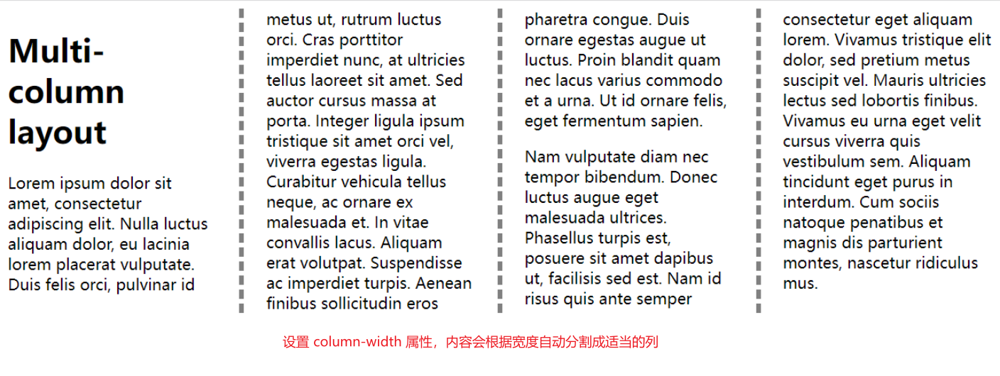
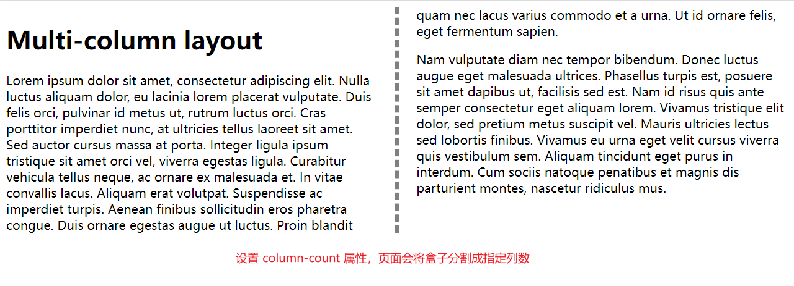
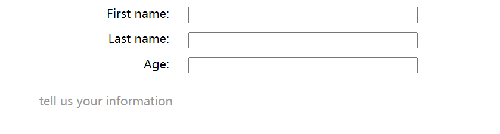

## 常用布局

### 多列布局

> 要把一个块转变成多列容器(multicol container)，我们可以使用 column-count 属性来告诉浏览器我们需要多少列，也可以使用 column-width 来告诉浏览器以至少某个宽度的尽可能多的列来填充容器。
#### 属性说明
| 属性                         | 说明                                     |
| ---------------------------- | ---------------------------------------- |
| column-width: 200px;         | 栏目宽度                                 |
| column-rule: 5px dashed red; | 栏目边框                                 |
| column-gap: 28px;            | 栏目间距                                 |
| column-count: 7;             | 栏目数，不能与 column-width 属性同时使用 |

多用于对于文字的排列，需要将文字分成好几列内容的时候使用。

#### 参考示例

```css
.container {
  /* column-width: 200px; */
  column-count: 2;
  column-rule: 5px dashed gray;
  column-gap: 50px;
}
```

```html
<div class="container">
  <h1>Multi-column layout</h1>
  <p>
    Lorem ipsum dolor sit amet, consectetur adipiscing elit. Nulla luctus
    aliquam dolor, eu lacinia lorem placerat vulputate. Duis felis orci,
    pulvinar id metus ut, rutrum luctus orci. Cras porttitor imperdiet nunc, at
    ultricies tellus laoreet sit amet. Sed auctor cursus massa at porta. Integer
    ligula ipsum tristique sit amet orci vel, viverra egestas ligula. Curabitur
    vehicula tellus neque, ac ornare ex malesuada et. In vitae convallis lacus.
    Aliquam erat volutpat. Suspendisse ac imperdiet turpis. Aenean finibus
    sollicitudin eros pharetra congue. Duis ornare egestas augue ut luctus.
    Proin blandit quam nec lacus varius commodo et a urna. Ut id ornare felis,
    eget fermentum sapien.
  </p>
  <p>
    Nam vulputate diam nec tempor bibendum. Donec luctus augue eget malesuada
    ultrices. Phasellus turpis est, posuere sit amet dapibus ut, facilisis sed
    est. Nam id risus quis ante semper consectetur eget aliquam lorem. Vivamus
    tristique elit dolor, sed pretium metus suscipit vel. Mauris ultricies
    lectus sed lobortis finibus. Vivamus eu urna eget velit cursus viverra quis
    vestibulum sem. Aliquam tincidunt eget purus in interdum. Cum sociis natoque
    penatibus et magnis dis parturient montes, nascetur ridiculus mus.
  </p>
</div>
```

#### 效果图




### 表格布局

> 一个`<table>`标签之所以能够像表格那样展示，是由于 css 默认给`<table>`标签设置了一组 table 布局属性。当这些属性被应用于排列非`<table>`元素时，这种用法被称为“使用 CSS 表格”。

#### 属性说明

| 属性                    | 说明         |
| ----------------------- | ------------ |
| display: table;         | 表格         |
| display: table-row;     | 表格行       |
| display: table-cell;    | 表格的列     |
| display: table-caption; | 表格标题     |
| caption-side: bottom;   | 定义标题位置 |

#### 参考示例
```html
<form>
  <p>tell us your information</p>
  <div>
    <label for="fname">First name:</label>
    <input type="text" id="fname">
  </div>
  <div>
    <label for="lname">Last name:</label>
    <input type="text" id="lname">
  </div>
  <div>
    <label for="age">Age:</label>
    <input type="text" id="age">
  </div>
</form>
```

```css
form {
  display: table;
  margin: 0 auto;
}
form div {
  display: table-row;
}
form label, form input {
  display: table-cell;
  margin-bottom: 10px;
}
form label {
  width: 200px;
  padding-right: 5%;
  text-align: right;
}
form input {
  width: 300px;
}
form p {
  display: table-caption;
  caption-side: bottom;
  width: 300px;
  color: #999;
}
```

#### 效果图

