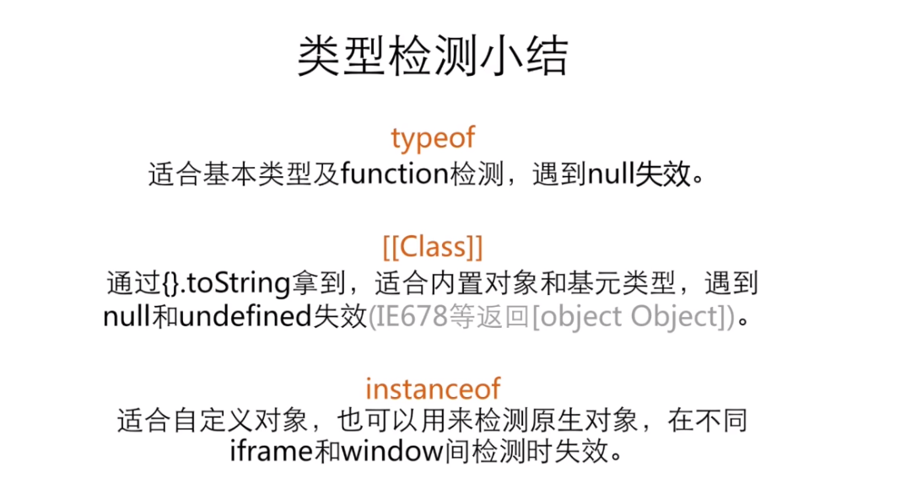

## 数据类型 
>JavaScript 有六种基础数据类型和一种引用数据类型，分别是：
> - 基础数据类型：`Boolean(true、false)、Number、String、Undefined(undefined)
Null、Symbol`
> - 引用数据类型：`Object`

其中 `NAN` 说明:
NaN 数字类型，无法表示的数字。
判断非数字，其中纯数字字符串会自动转成数值。

``` JavaScript
console.log( isNaN("2e") );//true 不是个数字是true

console.log( isNaN("22") );//false 是个数字是false

console.log( isNaN("22.34") );//false

console.log( isNaN(34) ); //false

console.log( isNaN("abs") ); //true
```


### 1 数据类型转换
数据类型的转换可以分为分为**强制转换**和隐式转换。


#### 1.1 强制类型转换

`Number(参数)` 把任何类型转换成数值类型。
`parseInt(参数)` 将字符串转换成整数。
`parseFloat(参数)` 将字符串转换成浮点数字。
`String(参数)` 可以将任何类型转换成字符串。
`Boolean(参数)` 可以将任何类型的值转换成布尔值。

具体使用参考以下：

1. 把第一个**非数字字符**之前的数字转成**整数**

``` JavaScript
console.log( parseInt("23.23") ); // 数字23

console.log( parseInt("23a.23") ); // 数字23

console.log( parseInt("bb23a") ); // NaN 

console.log( parseInt("237.2s3") ); // 数字237
```

2. 把第一个**非数字且非小数点字符**之前的数字转成**小数**

``` JavaScript
console.log( parseFloat("23.23") );//23.23

console.log( parseFloat("23a.23") );//23

console.log( parseFloat("bb23a") );//NaN

console.log( parseFloat("237.2s3") );//237.2
```

3. 其他类型转成**数字类型** 
除了数字之外，只要含有非小数点其他字符结果就是 NaN。

``` JavaScript
// Number() true---->1 false------>0

console.log( Number("23.23a") );// NaN

console.log( Number("23.23") ); //23.23 

console.log( Number("23a") ); //NaN

console.log( Number("23") ); //23

console.log( Number(true) );//1

console.log( Number(false) );//0 
```

4. 其他类型转成**布尔类型** 
非空字符串转成 true，空字符串转成 false；
非 0 数字转成 true，0 转成 false。

```JavaScript
console.log( Boolean("hello") ); // true 

console.log( Boolean("23.23") ); // true

console.log( Boolean("") );//false

console.log( Boolean(23) );//true

console.log( Boolean(0) );//false
```

5. `.toString()`  方法
`toString()`  有两种用法，一种适用于数据类型转换，将数据转为字符串类型；另一种是传递一个数字，将数据类型转为对应的进制数。

  ``` JavaScript
var num = 19;
var newNum = num.toString(); //类型转换
console.log( typeof newNum ); // string

var newNum = num.toString(8); //进制转换
console.log(newNum); // 转为八进制
```


#### 1.2 隐式类型转换

1. 四则运算

加法运算符+是双目运算符，只要其中一个是 String 类型，表达式的值便是一个 String。

对于其他的四则运算，只有其中一个是 Number 类型，表达式的值便是一个 Number。

对于非法字符的情况通常会返回NaN：

`'1' * 'a'   // => NaN`，这是因为 parseInt(a) 值为 NaN，1 * NaN 还是 NaN。

2. 判断语句

判断语句中的判断条件需要是 Boolean 类型，所以条件表达式会被隐式转换为 Boolean。其转换规则同 Boolean 的构造函数。比如：
` JavaScript
var obj = {};
if (obj) {
    while(obj);
  }
`

3. Native代码调用

JavaScript宿主环境都会提供大量的对象，它们往往不少通过JavaScript来实现的。  JavaScript给这些函数传入的参数也会进行隐式转换。例如BOM提供的alert方法接受String类型的参数：

`alert({a: 1});  // => [object Object]`


### 2 类型检测



#### 2.1 typeof

typeof返回的数据类型为：`undefined、string、boolean、number、symbol(ES6)、object、function`。
typeof 适合基本类型及 function 检测，遇到 null 失效，null 检测结果显示 object。

#### 2.2 instanceof

instanceof 运算符用来判断一个构造函数的 prototype 属性所指向的对象是否存在另外一个要检测对象的原型链上。可以用与区分是对象还是数组，更多判断数组的方法参考[2.06.2-判断数组的方法](2.06.2-判断数组的方法.md)。

基本使用：
`obj instanceof Object;//true 实例obj在不在Object构造函数中`