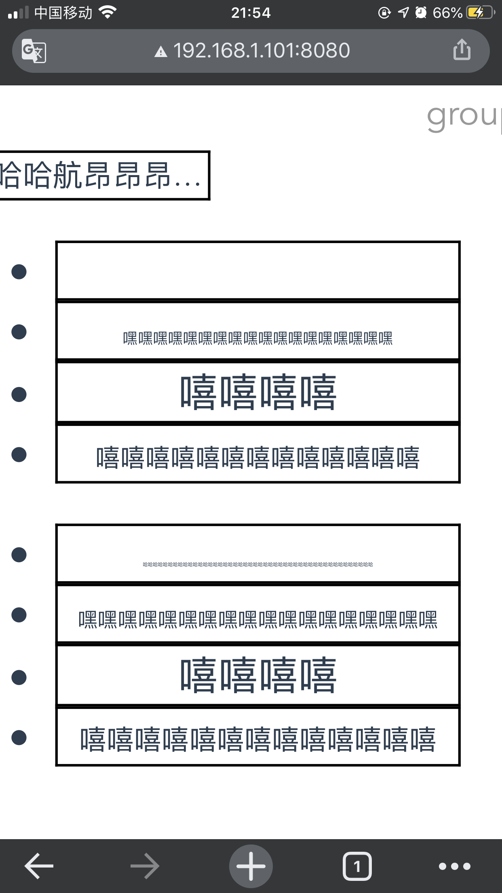

需求：给予固定宽度的一个盒子，盒子是存放金额的字段，现需根据字段的长度的不同需要能够放入盒子中，如果字段过长就缩小字体以适应盒子的宽度。

思路：盒子固定宽度，

以下是实现的三种方法：

```html
<template>
  <div id="app">
    <div class="titleBox" id="titleBox">
      <div
        class="title"
        id="title"
        @click="this.show = false"
        ref="test"
        name="test111"
      >
        哈哈哈航昂昂昂昂昂昂哈哈哈航昂
      </div>
    </div>

    <ul class="list_box">
      <li v-for="item in list" :key="item.id">
        <div class="money" ref="moneyFontBox">
          <span ref="moneyRef">{{ item.name }}</span>
        </div>
      </li>
    </ul>

    <ul class="list_box">
      <li v-for="item in list" :key="item.id">
        <div class="money" ref="moneyFontRef">{{ item.name }}</div>
      </li>
    </ul>
  </div>
</template>
```

方法

```js
moneyfontAuto () {
      // 获取父盒子宽度
      const moneyRef = this.$refs.moneyRef
      // 获取子盒子宽度
      const moneyBox = this.$refs.moneyFontBox
      console.log(moneyRef)
      for (let i = 0; i < moneyRef.length; i++) {
        let size = 16
        moneyRef[i].style.fontSize = size + 'px'
        let moneyRefWidth = moneyRef[i].offsetWidth
        const moneyBoxWidth = moneyBox[i].offsetWidth
        // 内容宽度大于父盒子宽度
        while (moneyRefWidth > moneyBoxWidth) {
          moneyRefWidth = moneyRef[i].offsetWidth
          size = size - 2
          moneyRef[i].style.fontSize = size + 'px'
          // font-size改变之前的宽度 <= 字体改变后的宽度。这里当字体变小宽度不变，说明达到浏览器最小字体
          if (moneyRefWidth <= moneyRef[i].offsetWidth) {
            moneyRef[i].classList.add('lineClamp1')
            break
          }
        }
      }
    },


    moneyfontAuto22 () {
      const moneyRef = this.$refs.moneyFontRef
      for (let i = 0; i < moneyRef.length; i++) {
        let size = 16
        moneyRef[i].style.fontSize = size + 'px'
        // offsetWidth
        const offsetWidth = moneyRef[i].offsetWidth
        // scrollWidth
        let scrollWidth = moneyRef[i].scrollWidth

        while (scrollWidth > offsetWidth) {
          scrollWidth = moneyRef[i].scrollWidth
          size = size - 1
          moneyRef[i].style.fontSize = size + 'px'
          console.log('****', scrollWidth, moneyRef[i].scrollWidth)
          // 变小之前的 scrollWidth 和 变小后的相比， 如果之前<=之后，跳出循环
          if (scrollWidth <= moneyRef[i].scrollWidth) {
            moneyRef[i].classList.add('lineClamp1')
            break
          }
        }
      }
    },

    fontAuto () {
      // let titleBox = document.getElementById('titleBox')
      const title = document.getElementById('title')
      let size = 4
      title.style.fontSize = size + 'vw'
      let scrollWidth = title.scrollWidth
      while (
        title.scrollWidth > document.getElementById('titleBox').offsetWidth
      ) {
        scrollWidth = title.scrollWidth
        // 当容器高度大于最大高度的时候，上一个尝试的值就是最佳大小。
        size = size - 0.2
        title.style.fontSize = size + 'vw'
        // console.log(title.style.fontSize)
        if (scrollWidth <= title.scrollWidth) {
          title.classList.add('lineClamp1')
          title.classList.remove('toh')
          break
        }
      }
    }
```

pc 端效果图片


移动端效果图


