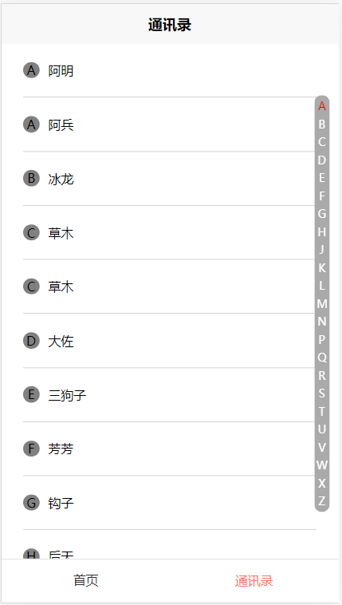

实现微信通讯录功能：

1. 页面滚动，右侧字母标签跟随滚动
2. 点击右侧的字母跳转到相应的用户位置

html 结构代码：

```html
<div class="page">
  <div v-for="(userList, index) in userGroup" :key="index">
    <div
      v-for="(user, idx) in userList.users"
      :key="idx"
      class="user-group"
      @tap="gotoUserInfo(user.name)"
    >
      <div class="pic">{{user.tag}}</div>
      <div class="name">{{user.name}}</div>
    </div>
  </div>
  <div class="num-group">
    <div
      v-for="(item, index) in groupTagList"
      class="num"
      :key="index"
      :class="currentTag == item ? 'active' : '' "
      @tap="gotoUser(item)"
    >
      {{item}}
    </div>
  </div>
</div>
```

逻辑代码：

```javascript
<script>
	import userList from '../common/list.js'
	export default {
		data() {
			return {
        currentTag: 'A'
			}
		},
    computed: {
      // 获取右侧标签数组
      groupTagList() {
        let arr = userList.map(item => item.tag)
        let filterArr = Array.from(new Set(arr)).sort()
        return filterArr
      },
      // 获取用户按字母分组的数据
      userGroup() {
        let userSort = userList.sort((a, b) => {
          return a.tag.localeCompare(b.tag)
        })
        let userGroup = {} //
        userSort.map((user, index) => {
          if(!userGroup[user.tag]) {
            userGroup[user.tag] = {}
            userGroup[user.tag].top = index * 60
            userGroup[user.tag].users = []
          }
          userGroup[user.tag].users.push(user)
        })
        console.log(userGroup)
        return userGroup
      }
    },
    // 监听页面滚动钩子
		onPageScroll(e) {
      console.log(e)
      for (let ug in this.userGroup) {
        if (this.userGroup[ug].top < e.scrollTop) {
          this.currentTag = ug
        }
      }
    },
    methods: {
			gotoUser(ug) {
				this.currentTag = ug
        uni.pageScrollTo({
          duration: 30,
          scrollTop: this.userGroup[ug].top
        })
			},
      // 去用户详情界面
      gotoUserInfo(name) {
        console.log(name)
        uni.navigateTo({
          url: '/pages/user?user=' + name
        })
      }
		}

	}
</script>
```

css 样式代码，此处就是为了显示一个效果，没有细写

```scss
<style lang="scss">
	.page {
		padding: 0 24px;
    font-size: 14px;
	}
	.user-group {
		display: flex;
		justify-content: flex-start;
		align-items: center;
		padding: 20px 0;
    border-bottom: 1px solid #ccc;
		.pic {
			width: 18px;
			height: 18px;
			border-radius: 50%;
			background-color: gray;
			text-align: center;
			line-height: 18px;
			margin-right: 10px;
		}

		.name {
			flex: 1;
		}
	}
  .num-group {
    position: fixed;
    top: 50%;
    right: 20rpx;
    transform: translateY(-50%);
    text-align: center;
    border-radius: 20rpx;
    background-color: #aaa;
    padding: 5rpx 0;
    font-size: 24rpx;
    .num {
      padding: 5rpx 5rpx;
      color: #fff;
    }
    .active {
      color: red;
    }
  }
</style>
```

实现效果图：


